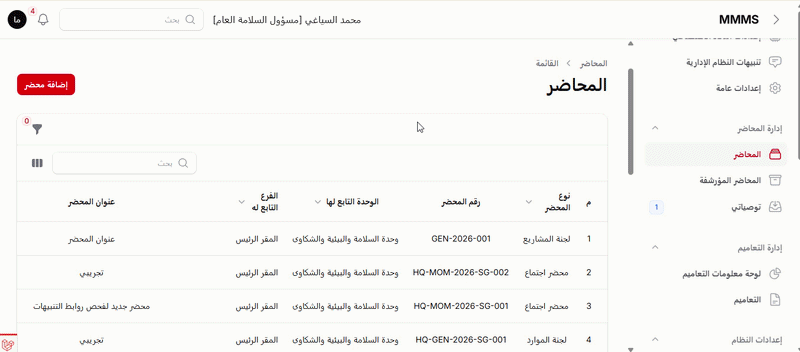

# Filament Table Drag Scroll

[](https://packagist.org/packages/majid-shafik/filament-table-drag-scroll)
[](https://github.com/Majid-Shafik/filament-table-drag-scroll/actions)
[](https://packagist.org/packages/majid-shafik/filament-table-drag-scroll)



Grab and drag horizontally scrollable Filament tables with a mouse. The package works with Filament panels and standalone tables, including RTL layouts, Livewire updates, and SPA navigation.

## Features

- Automatically detects horizontally scrollable Filament tables.
- Uses native Pointer Events and the primary mouse button.
- Preserves links, buttons, inputs, sorting, and reordering controls.
- Prevents accidental row clicks after a real drag.
- Cancels when the gesture is primarily vertical.
- Requires no JavaScript build step and does not modify Filament vendor files.

## Requirements

- PHP 8.2 or newer.
- Filament 5.x.

## Installation

Install the package through Composer:

```bash
composer require majid-shafik/filament-table-drag-scroll
```

Publish Filament assets, then refresh the browser:

```bash
php artisan filament:assets
```

No panel provider changes are required. The package is enabled automatically through Laravel package discovery.

## Configuration

The defaults work for standard Filament tables. To customize them, publish the config file:

```bash
php artisan vendor:publish --tag="filament-table-drag-scroll-config"
```

You may disable the behavior, change the drag threshold, or add selectors that must remain interactive:

```php
return [
    'enabled' => true,
    'drag_threshold' => 6,
    'excluded_selectors' => [
        'a',
        'button',
        'input',
        'select',
        'textarea',
        'label',
        '[contenteditable="true"]',
        '[draggable="true"]',
        '[role="button"]',
        '[x-sortable-handle]',
        '.fi-ta-reorder-handle',
    ],
];
```

After changing package assets, run `php artisan filament:assets` again.

## Testing

```bash
composer test
composer test:lint
composer analyse
node --check resources/js/table-drag-scroll.js
```

## Changelog

See [CHANGELOG.md](CHANGELOG.md) for release history.

## Security

Please report security issues privately as described in [SECURITY.md](.github/SECURITY.md).

## License

The MIT License. See [LICENSE.md](LICENSE.md).
#   f i l a m e n t - t a b l e - d r a g - s c r o l l 
 
 
